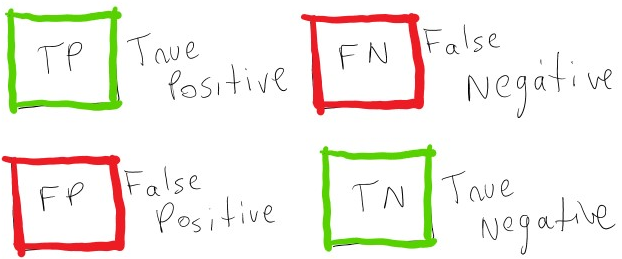

## What's Confusion Matrix

Confusion Matrix, is a **matrix** and... we all agree.

Confusion Matrix can answer to the questions: 
- How is going the prediction? 
- Which one I constantly missed?

Confusion Matrix is composed by following components:

What's TP? 
- True Positive: it's what the model have predicted right. On my [current work](aluminium-scraps-box-weight-random-forest-post.html) I'm trying to predict the weight of a box (about `11` classes). The box weight `750`? Yes, it falls into TP recipient. If not, it falls into FP.

What's FP?
- False Positive:  it's what the model have predicted wrong. The model thought the box weight ``750`` KG but it isn't. Wrong prediction.

What's TN:
- True Negative: the model understood that box weight isn't `750` KG. It falls into TN recipient. If not, it falls into FN.

What's FN:
- False Negative: the model predicted `not 750` KG and was wrong. It falls into FN recipient. it's the opposite behavior of FP. Someone would say: [invert. always invert](https://jamesclear.com/inversion)

## When Confusion Matrix

This kind of matrix is applicable only on [Classification Problem]().

## Why Confusion Matrix

On top of Confusion Matrix have been developer lots of metrics. :
- [Accuracy]()
- [Precision]()
- [Recall]()
- [F-Score]()
- [AUC ROC]()

## Implementation

**If you have any suggestions, recommendations, or corrections please [reach out to me](https://twitter.com/bot_fra).**

---

